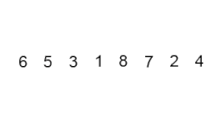

# Bubble Sort

Bubble sorting is one of the simplest sortings commonly used to teach students. The principle of ascending bubble sorting is quite simple, we go through the array by moving the largest elements to the end of the array. Bubble sorting is a stable sorting algorithm. We swap elements only if one element (say `A`) is smaller than another (say `B`). If `A` is equal to `B`, we do not swap them, so the relative order between equal elements is preserved.

Here is the video of the bubble sorting example:

## Time and space complexity

|              	| Time complexity 	| Space complexity 	|
|--------------	|-----------------	|------------------	|
| Worst case   	| O(N^2)          	| O(1)             	|
| Average case 	| O(N^2)          	| O(1)             	|
| Best case    	| O(N)            	| O(1)             	|

## Source code reference

[Bubble Sort algorithm implementation](../../Algorithms/SortingAlgorithms/BubbleSorter.cs)
