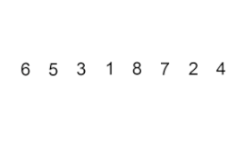

# Insertion Sort

Insertion Sorting is a sorting algorithm in which the elements of the input sequence are considered one at a time, and each newly arriving element is placed in an appropriate position among the previously ordered elements. Insertion sorting is a stable sorting algorithm. In selection sorting, we swap the order of any two items only if the item on the right is smaller than the item on the left. Therefore, the order of two equivalent items is always preserved in insertion sorting.

Here is the video of the insertion sorting example:

|              	| Time complexity 	| Space complexity 	|
|--------------	|-----------------	|------------------	|
| Worst case   	| O(N^2)          	| O(1)             	|
| Average case 	| O(N^2)          	| O(1)             	|
| Best case    	| O(N)            	| O(1)             	|

## Source code reference

[Insertion Sort algorithm implementation](../../Algorithms/SortingAlgorithms/InsertionSorter.cs)
